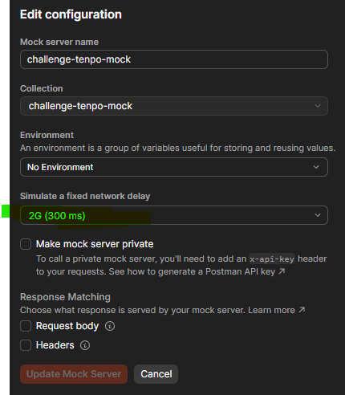
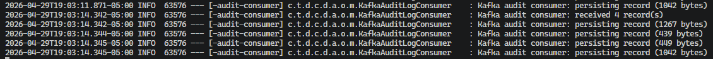
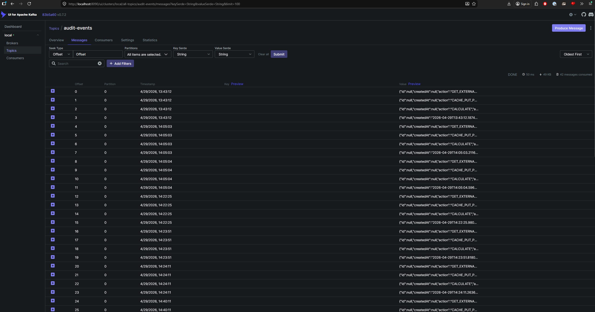
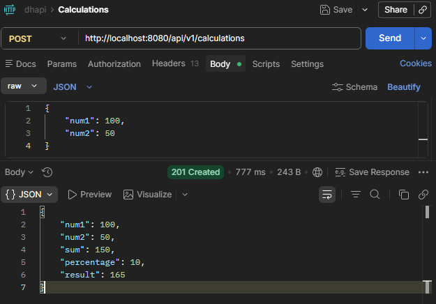

# Tenpo Challenge API

REST API reactiva construida con **Spring Boot 4 / WebFlux** para el challenge técnico de Tenpo.

Expone un endpoint de cálculo que recibe dos números y devuelve su suma aplicando un porcentaje dinámico obtenido de un servicio externo: `resultado = (num1 + num2) × (1 + porcentaje/100)`. El porcentaje se cachea en Redis y tiene fallback automático si el servicio externo falla. Cada request queda registrada en un log de auditoría en PostgreSQL, publicado de forma asíncrona vía Kafka. El acceso está protegido con rate limiting por IP.

## Características

- **Cálculo con porcentaje dinámico**: `result = (num1 + num2) * (1 + pct/100)`, con retry automático (3 intentos) y fallback a caché
- **Caché Redis** con TTL 30 minutos para el último porcentaje obtenido
- **Rate limiting**: 3 RPM por IP usando Redis, con headers `X-RateLimit-*` y respuesta 429
- **Auditoría automática**: log de todas las llamadas API en PostgreSQL, con paginación
- **RFC 7807 Problem Details** para manejo de errores
- **Arquitectura hexagonal** (Ports & Adapters)

## Tech Stack

| Componente | Tecnología |
|---|---|
| Framework | Spring Boot 4.0.6 / Spring Framework 7 |
| Reactive | Spring WebFlux + Project Reactor |
| Persistencia | Spring Data R2DBC + PostgreSQL 16 |
| Migraciones | Flyway 11 |
| Caché | Spring Data Redis (Reactive) |
| Documentación | SpringDoc OpenAPI 3 (Swagger UI) |
| Tests | JUnit 5 + Mockito + Testcontainers + Cucumber |

## Prerrequisitos

- Java 21+
- Docker & Docker Compose
- (Opcional) Maven 3.9+

---

## Formas de ejecutar la aplicación

### Opción 1 — `./mvnw spring-boot:run` (perfil base)

Igual a ejecutar el JAR directamente. Conecta a PostgreSQL y Redis en `localhost` usando los
fallbacks de `application.yaml`. Requiere que los servicios ya estén corriendo.

Ideal si estas cambiando código de la aplicación y quieres controlar manualmente el ciclo de vida de la infraestructura (por ejemplo, para debuggear con breakpoints).

```bash
# Opcional - Levantar infraestructura localmente con Docker Compose
docker compose up -d

# Ejecutar la aplicación (perfil base, sin docker-compose automático)
./mvnw spring-boot:run

# Para detener la infraestructura local:
docker compose down
```
---

### Opción 2 — `./mvnw spring-boot:run -Dspring-boot.run.profiles=docker` (recomendado)

Activa el perfil `docker`, que usa **spring-boot-docker-compose** para levantar PostgreSQL + Redis
automáticamente antes de iniciar la app. No se necesita ningún paso previo.

```bash
./mvnw spring-boot:run -Dspring-boot.run.profiles=docker
```

Spring Boot levanta los servicios del `docker-compose.yml`, ejecuta las migraciones Flyway
y expone la API en **http://localhost:8080**.

Para detener: `Ctrl+C` (baja los contenedores automáticamente).

> **Nota 1:** esta opción es ideal para desarrollo local rápido, ya que no requiere tener Docker Compose corriendo todo el tiempo. Sin embargo, no es compatible con tests de integración o BDD que usan Testcontainers, ya que esos tests esperan controlar el ciclo de vida de los contenedores manualmente.

> **Nota 2:** Cuando le das Ctrl+C, actualmente esta devolviendo un error de BUILD FAILURE al intentar `Graceful shutdown`. No es un bug perse, necesito mejorar el @PreDestroy mejor, lo tengo mapeado como deuda tecnica
---

### Opción 3 — `docker compose -f docker-compose.full.yml up --build` (stack completo)

Construye la imagen de la API y levanta todo (API + PostgreSQL + Redis) como contenedores Docker.
No requiere Java ni Maven instalados.

> Podriamos decirlo como la opción "production-like" ya que simula un entorno completamente dockerizado, aunque con la simplicidad de un solo comando.

```bash
# Construir imagen y levantar el stack completo
docker compose -f docker-compose.full.yml up --build

# En background
docker compose -f docker-compose.full.yml up --build -d

# Ver logs de la API
docker compose -f docker-compose.full.yml logs -f api

# Detener y limpiar volúmenes
docker compose -f docker-compose.full.yml down -v
```

La API quedará disponible en **http://localhost:8080**.

---

### Opción 4 — JAR standalone

```bash
# Construir el JAR
./mvnw clean package -DskipTests

# Ejecutar (perfil base, conecta a localhost por defecto)
java -jar target/dhapi-1.0.0.jar

# Con perfil docker (auto-inicia docker-compose)
java -jar target/dhapi-1.0.0.jar --spring.profiles.active=docker

# Con variables de entorno personalizadas
SPRING_R2DBC_URL=r2dbc:postgresql://myhost:5432/mydb \
SPRING_DATA_REDIS_HOST=myredis \
java -jar target/dhapi-1.0.0.jar
```

---

## Endpoints

Los endpoints fueron diseñados siguiendo las mejores prácticas de REST y API versioning de Spring Boot 4. Para mantener esta sección concisa, se describen sólo los aspectos más relevantes.

**Tambien fueron pensados para estar detras de un API Gateway que inyecta headers de tracing (`X-Transactional-Id`) y autenticación (`X-User-Id`), por lo que estos headers son requeridos en las llamadas a la API.**

Para detalles completos de los endpoints, request/response, headers, y ejemplos, ver [API Endpoints](./docs/endpoints.md).

Podras encontrar el swagger json generado en `http://localhost:8080/v3/api-docs` una vez que la aplicación esté corriendo. Este JSON es consumido por Swagger UI para mostrar la documentación interactiva.

La ultima version descargada se encuentra tambien en [API Docs](./docs/api-docs.json) en este repositorio

---

### Swagger UI
Documentación interactiva disponible en:
```
http://localhost:8080/swagger-ui.html
```

> Nota: tienes que ejecutar la aplicación para acceder a Swagger UI, ya que se genera dinámicamente a partir de los controladores y modelos de Spring Boot.

---

## Como funciona?

### Usando la API

Todos los endpoints requieren dos headers que en producción inyectaría el API Gateway, pero en desarrollo los mandas tú mismo:

> Si usas Postman puedes utilizar `{{$randomUUID}}` para generar valores únicos para cada request.
> `x-transactional-id:{{$randomUUID}}`
> `x-user-id:{{$randomUUID}}`

| Header | Descripción | Ejemplo |
|---|---|---|
| `X-Transactional-Id` | ID de correlación para rastrear la request a través de los servicios | `3760c8d0-aff2-42f1-9195-85211c4b1afd` |
| `X-User-Id` | Identidad del usuario autenticado | `99f1fa92-3b4f-4cab-b736-3accd63c9b95` |

El flujo principal es simple: mandás dos números, la app obtiene un porcentaje dinámico (con caché y fallback automático), calcula el resultado y lo devuelve. Todo queda registrado en los audit logs.

> Para ver los diagramas de flujo detallados de cada proveedor de porcentaje, consultá [Flujo de cálculo](./docs/calculations.md).
---

## Percentage Provider

El porcentaje utilizado en el cálculo puede ser provisto por tres modos distintos, configurados con `PERCENTAGE_PROVIDER`:

| Modo | Descripción | Default? | Default en `docker-compose.full.yml` |
|---|---|---|---|
| `memory` | Responde siempre un valor fijo (default `10.0`). Ideal para desarrollo rápido. | Sí | No |
| `postman-mock` | Apunta a un mock de Postman. Permite controlar la respuesta via headers. | No | Sí |
| `external` | Servicio externo real configurado con `PERCENTAGE_EXTERNAL_*`. _Nota: Deberia de mantener el contrato del response requerido por la app_ | No | No |

> 1. Revisar application.yaml para más detalles de configuración de cada modo.
> 2. Revisar `docker-compose.full.yml` para ver que modo se usa por defecto en ese entorno.

Independientemente del modo, el flujo siempre sigue este patrón:

1. **Consultar el proveedor** → si responde OK, guardar en caché Redis (TTL 30 min) y continuar
2. **Si falla** → intentar usar el último valor cacheado en Redis
3. **Si el caché también está vacío** → devolver `503`

> Los diagramas de flujo para cada proveedor están en [Flujo de cálculo](./docs/calculations.md).
> Nota: Actualmente el Mock de Postman se encuentra en mi cuenta y esta configurado con 2G de latencia de red. Esto quiere decir que puede demorar en responder, lo cual es ideal para probar el comportamiento de timeout y retry del cliente HTTP. Si querés modificar la latencia o el porcentaje que devuelve



### Headers de control para pruebas

Disponibles en modos `memory` y `postman-mock`:

| Header | Tipo | Descripción |
|---|---|---|
| `x-mock-percentage` | Numérico | **`memory`**: sobreescribe el valor de porcentaje.<br>**`postman-mock`**: se reenvía a Postman como header. Acepta valores negativos. |
| `x-mock-response-code` | HTTP code | **`memory`**: si es non-2xx → simula falla del proveedor externo.<br>**`postman-mock`**: se reenvía a Postman como header. |

---

## Audit Provider

Cada request que entra a la API — y cada llamada saliente al proveedor de porcentaje — queda registrada automáticamente en PostgreSQL sin afectar la respuesta principal (fire-and-forget reactivo).

### Qué se registra

| Campo | Descripción |
|---|---|
| `action` | Nombre semántico de la operación (ej. `CALCULATE`, `GET_PERCENTAGE`) |
| `actionType` | Categoría: `HTTP_REQUEST`, `CALCULATION`, `EXTERNAL_CALL`, `CACHE_ACCESS`, `SYSTEM` |
| `callDirection` | `IN` para requests entrantes, `OUT` para llamadas salientes |
| `userId` / `transactionalId` | Tomados de los headers `X-User-Id` y `X-Transactional-Id` |
| `method` / `endpoint` / `params` | Detalles de la request HTTP |
| `requestHeaders` / `requestBody` | Snapshot de la request |
| `responseHeaders` / `responseBody` | Snapshot de la respuesta |
| `statusCode` | Código HTTP resultante |
| `durationMs` | Tiempo de ejecución en milisegundos |
| `errorMessage` | Mensaje de error si la operación falló |

### Como se publica el evento

| Modo | Descripción | Valor por defecto | `docker-compose.full.yml` |
|---|---|---|---|
| `memory` | Persiste el audit log asincrónicamente usando Webflux en PostgreSQL. | Sí | No |
| `kafka` | Publica cada evento en un tópico Kafka; el consumer lo consume de forma asíncrona y lo persiste en PostgreSQL, desacoplando la escritura del flujo principal de la request. | No | Sí |

Si estas usando el modo `kafka`, asegurate de tener Kafka corriendo (puede ser local o en Docker) y que la configuración de `bootstrap-servers` sea correcta. El tópico se llama `audit-events` y se crea automáticamente si no existe.

Y veras en los logs algo como esto:



Para ver los mensajes enviados tenemos Kafka UI disponible en `http://localhost:8090/ui/clusters/local/all-topics/audit-events/messages?keySerde=String&valueSerde=String&limit=100`



### Consultando los audit logs

Los audit logs se exponen via REST con soporte de paginación, filtros y ordenamiento. Para el detalle de los endpoints disponibles ver [API Endpoints](./docs/endpoints.md).

---

### Casos de uso con cURL

#### 1. Cálculo básico (porcentaje por defecto 10%)

```bash
curl --location 'http://localhost:8080/api/v1/calculations' \
--header 'x-transactional-id: 3760c8d0-aff2-42f1-9195-85211c4b1afd' \
--header 'x-user-id: 99f1fa92-3b4f-4cab-b736-3accd63c9b95' \
--header 'Content-Type: application/json' \
--data '{
    "num1": 100,
    "num2": 50
}'
```

Respuesta esperada (`201 Created`):
```json
{
    "num1": 100,
    "num2": 50,
    "sum": 150,
    "percentage": 10.0,
    "result": 165
}
```

> `result = (100 + 50) × (1 + 10/100) = 150 × 1.1 = 165`



---

#### 2. Cálculo con porcentaje personalizado

Usando el header `x-mock-percentage` podés sobreescribir el porcentaje que devuelve el proveedor (disponible en `memory` y `postman-mock`):

```bash
curl --location 'http://localhost:8080/api/v1/calculations' \
--header 'x-mock-percentage: 25' \
--header 'x-transactional-id: 3760c8d0-aff2-42f1-9195-85211c4b1afd' \
--header 'x-user-id: 99f1fa92-3b4f-4cab-b736-3accd63c9b95' \
--header 'Content-Type: application/json' \
--data '{
    "num1": 100,
    "num2": 50
}'
```

> `result = 150 × 1.25 = 187.5`

---

#### 3. Simular falla del proveedor de porcentaje (con caché disponible)

Primero hacé una llamada normal para que el porcentaje quede cacheado en Redis, después simulá la falla:

```bash
# Simular falla del servicio externo
curl --location 'http://localhost:8080/api/v1/calculations' \
--header 'x-mock-response-code: 500' \
--header 'x-transactional-id: 3760c8d0-aff2-42f1-9195-85211c4b1afd' \
--header 'x-user-id: 99f1fa92-3b4f-4cab-b736-3accd63c9b95' \
--header 'Content-Type: application/json' \
--data '{
    "num1": 100,
    "num2": 50
}'
```

Como hay un valor cacheado en Redis (del llamado anterior), la app hace fallback y devuelve igual `201` usando el último porcentaje conocido.

---

#### 4. Simular falla total (sin caché → 503)

Si el caché Redis está vacío y el proveedor falla, la app no puede calcular y devuelve `503`:

```bash
# Limpiar caché Redis primero
docker exec -it <redis-container> redis-cli FLUSHALL

# Luego simular falla
curl --location 'http://localhost:8080/api/v1/calculations' \
--header 'x-mock-response-code: 500' \
--header 'x-transactional-id: 3760c8d0-aff2-42f1-9195-85211c4b1afd' \
--header 'x-user-id: 99f1fa92-3b4f-4cab-b736-3accd63c9b95' \
--header 'Content-Type: application/json' \
--data '{
    "num1": 100,
    "num2": 50
}'
```

Respuesta (`503 Service Unavailable`):
```json
{
    "type": "about:blank",
    "title": "Service Unavailable",
    "status": 503,
    "detail": "Percentage service is unavailable and no cached value exists"
}
```

---

#### 5. Consultar el historial de audit logs

Cada llamada a la API queda registrada automáticamente. Podés consultarlo paginado:

> Nota 1: Este endpoint devuelve todos los audit logs, no sólo los relacionados a tu request. Para filtrar por usuario o por transactional ID, usá los endpoints específicos que se describen a continuación.
> Nota 2: Los elementos son mas "light" a comparacion de los otros endpoints

```bash
curl --location 'http://localhost:8080/api/v1/audit-logs?page=0&size=10&sort=createdAt,desc' \
--header 'x-transactional-id: 3760c8d0-aff2-42f1-9195-85211c4b1afd' \
--header 'x-user-id: 99f1fa92-3b4f-4cab-b736-3accd63c9b95'
```

> Nota: Este endpoint excluye los logs de `action` = `GET_AUDIT_LOGS` para evitar ruido. Si querés ver esos logs también, usá el endpoint de `GET /api/v1/audit-logs` que no tiene ese filtro implicito.

#### 6. Filtrar audit logs por usuario

```bash
curl --location 'http://localhost:8080/api/v1/audit-logs/users/99f1fa92-3b4f-4cab-b736-3accd63c9b95' \
--header 'x-transactional-id: 3760c8d0-aff2-42f1-9195-85211c4b1afd' \
--header 'x-user-id: 99f1fa92-3b4f-4cab-b736-3accd63c9b95'
```

> Nota: Este endpoint excluye los logs de `action` = `GET_AUDIT_LOGS` para evitar ruido. Si querés ver esos logs también, usá el endpoint de `GET /api/v1/audit-logs` que no tiene ese filtro implicito.

#### 7. Filtrar audit logs por transactional ID

Útil para rastrear todos los eventos generados por una request específica. El `transactional-id` que usás en el header de la llamada es el mismo con el que podés consultar su traza completa:

```bash
curl --location 'http://localhost:8080/api/v1/audit-logs/transactions/ee8bcaa6-83bb-42e9-b25c-eca66e0fe2e0' \
--header 'x-transactional-id: 3760c8d0-aff2-42f1-9195-85211c4b1afd' \
--header 'x-user-id: 99f1fa92-3b4f-4cab-b736-3accd63c9b95'
```

> Por ejemplo, si hiciste un `POST /calculations` con `x-transactional-id: ee8bcaa6-83bb-42e9-b25c-eca66e0fe2e0`, este endpoint te devuelve todos los eventos asociados a esa request: la llamada HTTP entrante, la llamada al proveedor de porcentaje, el acceso a caché y el evento de cálculo.

#### 8. Ver detalle completo de un audit log (con headers y body)

```bash
curl --location 'http://localhost:8080/api/v1/audit-logs/1' \
--header 'x-transactional-id: 3760c8d0-aff2-42f1-9195-85211c4b1afd' \
--header 'x-user-id: 99f1fa92-3b4f-4cab-b736-3accd63c9b95'
```

---

## Rate Limiting

Se implementa con Redis usando el patrón INCR + EXPIRE:
- **Ventana**: 60 segundos
- **Máximo**: 3 requests por IP por ventana
- **Headers de respuesta**:
  - `X-RateLimit-Limit: 3`
  - `X-RateLimit-Remaining: 2` (requests restantes)
  - `X-RateLimit-Reset: 45` (segundos hasta reset)
- **Respuesta 429** incluye `Retry-After` header

## Arquitectura

Arquitectura hexagonal (Ports & Adapters): el dominio no tiene dependencias de Spring ni de infraestructura. Los adaptadores se conectan a través de interfaces (puertos) y son intercambiables sin tocar el núcleo.

| Capa | Contenido |
|---|---|
| **Domain** | Modelos + puertos IN (UseCases) + puertos OUT (SPIs) — cero dependencias externas |
| **Application** | Servicios que implementan los casos de uso y orquestan los puertos |
| **Adapter IN** | Filtros WebFlux + Controllers REST |
| **Adapter OUT** | Clientes HTTP, Redis, Kafka, PostgreSQL R2DBC |

Para el diagrama completo, estructura de packages y decisiones de diseño, ver [Arquitectura](./docs/architecture.md).

## Resiliencia

El proveedor de porcentaje es el único punto de falla externo. La resiliencia se implementa en capas:

1. **Timeout** — 5 s por llamada (configurable con `PERCENTAGE_TIMEOUT_SECONDS`)
2. **Retry con backoff exponencial** — hasta 3 reintentos, backoff 1 s → 5 s
3. **Circuit Breaker** (Resilience4j) — se abre si ≥ 50% de las últimas 10 llamadas fallan; permanece abierto 30 s antes de pasar a HALF-OPEN
4. **Fallback a caché Redis** — si el circuito está abierto o todos los reintentos fallan, usa el último porcentaje cacheado (TTL 30 min)
5. **503** si el caché también está vacío

Para los parámetros completos, variables de entorno y diagramas de flujo, ver [Resiliencia](./docs/resilience.md).

## Variables de entorno

Todas las propiedades de conexión soportan variables de entorno con fallback a valores localhost:

| Variable | Valor por defecto | `docker-compose.full.yml` | Descripción |
|---|---|---|---|
| `SPRING_R2DBC_URL` | `r2dbc:postgresql://localhost:5432/tenpo_db` | `r2dbc:postgresql://postgres:5432/tenpo_db` | URL R2DBC de PostgreSQL |
| `SPRING_R2DBC_USERNAME` | `tenpo` | `tenpo` | Usuario R2DBC |
| `SPRING_R2DBC_PASSWORD` | `tenpo_pass` | `tenpo_pass` | Contraseña R2DBC |
| `SPRING_DATASOURCE_URL` | `jdbc:postgresql://localhost:5432/tenpo_db` | — | URL JDBC (Flyway) |
| `SPRING_DATASOURCE_USERNAME` | `tenpo` | — | Usuario JDBC |
| `SPRING_DATASOURCE_PASSWORD` | `tenpo_pass` | — | Contraseña JDBC |
| `SPRING_FLYWAY_URL` | `jdbc:postgresql://localhost:5432/tenpo_db` | `jdbc:postgresql://postgres:5432/tenpo_db` | URL JDBC para migraciones |
| `SPRING_FLYWAY_USER` | `tenpo` | `tenpo` | Usuario Flyway |
| `SPRING_FLYWAY_PASSWORD` | `tenpo_pass` | `tenpo_pass` | Contraseña Flyway |
| `SPRING_DATA_REDIS_HOST` | `localhost` | `redis` | Host de Redis |
| `SPRING_DATA_REDIS_PORT` | `6379` | `6379` | Puerto de Redis |
| `PERCENTAGE_PROVIDER` | `memory` | `postman-mock` | Proveedor de porcentaje (`memory`, `postman-mock`, o cualquier otro valor para externo) |
| `PERCENTAGE_CACHE_TTL` | `1800` | `1800` | TTL del caché de porcentaje en segundos (default: 30 min) |
| `PERCENTAGE_MEMORY_VALUE` | `10.0` | — | Porcentaje fijo usado en modo `memory` |
| `PERCENTAGE_POSTMAN_BASE_URL` | `https://ec995055-c0c3-4482-aa85-89f5660540f0.mock.pstmn.io` | `https://ec995055-c0c3-4482-aa85-89f5660540f0.mock.pstmn.io` | URL base del mock de Postman |
| `PERCENTAGE_POSTMAN_PATH` | `/mock/percentage` | `/mock/percentage` | Path del endpoint de Postman |
| `PERCENTAGE_EXTERNAL_BASE_URL` | `http://localhost:8080` | — | URL base del servicio externo real |
| `PERCENTAGE_EXTERNAL_PATH` | `/percentage` | — | Path del endpoint externo |
| `RATE_LIMIT_MAX_REQUESTS` | `3` | — | Requests máximos por ventana |
| `RATE_LIMIT_WINDOW_SECONDS` | `60` | — | Tamaño de la ventana en segundos |


## Tests

```bash
# Sólo tests unitarios (no requieren Docker)
./mvnw test

# Tests de integración + BDD (requieren Docker)
docker compose up -d
./mvnw test -P integration-tests
```

**Suite de tests:**
- **Tests unitarios** — servicios de dominio, filtros y manejo de errores
- **Tests de integración** — Spring Boot + Testcontainers (PostgreSQL + Redis)
- **BDD/Cucumber** — features: cálculo, caché, rate limiting, audit logs

**Coverage:** mínimo **80% de líneas** enforced por JaCoCo en cada build (`./mvnw test`). Excluye clases generadas (config de Spring, interfaces de port, MapStruct, Spring Data).

> Tests de integración y BDD requieren Docker corriendo (Testcontainers gestiona el ciclo de vida de los contenedores).
> Ver más detalles en [Integration Tests](./docs/integration-tests.md)

---

## Deuda técnica / Backlog

### Deuda técnica

- **`[DEUDA]` Graceful shutdown en `./mvnw spring-boot:run`** — Al hacer `Ctrl+C` se produce un `BUILD FAILURE` durante el shutdown. El `@PreDestroy` necesita mejorar el ciclo de vida para bajar los contenedores Docker Compose limpiamente.

- **`[DEUDA]` El consumer de Kafka puede perder mensajes si la app se cae en el momento justo** — El consumer lee un mensaje de Kafka, lo manda a guardar en PostgreSQL (de forma asíncrona, fire-and-forget), y acto seguido le dice a Kafka "ya procesé este mensaje" (`commitAsync`). El problema: si la app se cae entre el "manda a guardar" y la confirmación real de PostgreSQL, Kafka ya no reentregará el mensaje porque lo considera procesado, y el audit log se pierde. Esto es lo que se llama **at-most-once**: cada mensaje se procesa a lo sumo una vez, pero sin garantía de que llega. El diseño opuesto (**at-least-once**) haría el commit solo después de confirmar que PostgreSQL guardó el dato, pero eso requiere esperar el resultado del `Mono`, lo que no es trivial cuando el consumer vive en un hilo imperativo (virtual thread) y la persistencia es reactiva (R2DBC). Para audit logs es un tradeoff aceptable, pero vale tenerlo en cuenta.

- ~~**`[DEUDA]` api/v1/audit-logs/transactions/ee8bcaa6-83bb-42e9-b25c-eca66e0fe2e0 No esta bien ordenado...** Deberia de ordenarse asi `ORDER BY created_at DESC, transactional_id DESC` para una mejor lectura de eventos relacionados.~~

### Nice-to-have

- **`[FEAT]` Rate limiting por usuario además de por IP** — El rate limit actual aplica por IP, lo cual puede ser insuficiente detrás de un proxy o NAT compartido. Agregar una ventana adicional por `X-User-Id`.

- **`[FEAT]` Escoger percentage provider por header** — Permitir que el cliente elija el proveedor mediante un header (ej. `X-Percentage-Provider: postman-mock`), sin necesidad de reiniciar la aplicación ni cambiar variables de entorno.

- **`[FEAT]` Retry con backoff exponencial configurable por cliente** — Actualmente el retry está configurado globalmente para todos los providers HTTP. Podría ser útil tener configuración independiente por proveedor (ej. mayor tolerancia para el mock de Postman).

- **`[FEAT]` Endpoint para invalidar caché manualmente** — Un endpoint protegido que permita limpiar el caché de porcentaje en Redis, útil para pruebas o situaciones de emergencia.

- **`[FEAT]` Idenpotency Key para evitar cálculos duplicados** — Si llegan dos requests con el mismo `X-Transactional-Id`, podrían compartir el resultado del cálculo en lugar de ejecutar dos veces el proceso completo. Ver propuesta detallada en [Idempotency Key Plan](./docs/idenpotency-key-plan.md).


