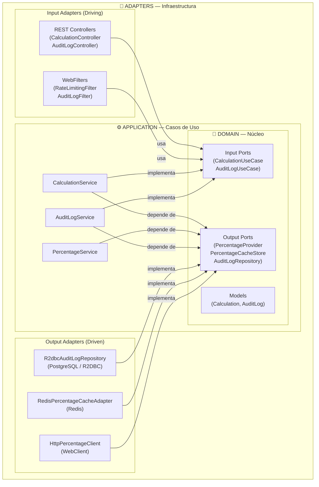

# Tenpo Challenge API REST

## Stack Tecnológico

| Componente         | Tecnología                              |
|--------------------|-----------------------------------------|
| Lenguaje           | Java 21 (records, sealed classes)       |
| Framework          | Spring Boot 4 / Spring WebFlux          |
| Build Tool         | Maven                                   |
| Base de Datos      | PostgreSQL 16 (R2DBC reactive driver)   |
| Caché Distribuido  | Redis 7 (ReactiveRedisTemplate)         |
| Migraciones DB     | Flyway                                  |
| Documentación API  | SpringDoc OpenAPI (Swagger UI)          |
| Contenedores       | Docker + Docker Compose                 |
| Tests              | JUnit 5 + Mockito + Testcontainers      |

---

## Arquitectura Hexagonal (Ports & Adapters)

El proyecto sigue la **Arquitectura Hexagonal**. El objetivo es aislar la lógica de negocio del mundo exterior, facilitando la testeabilidad, mantenibilidad y escalabilidad.

### Capas de la Arquitectura



### 1. Domain (Núcleo)

El corazón de la aplicación. Contiene la lógica de negocio pura sin dependencias externas.

- **Models**: Objetos de dominio que representan conceptos del negocio (`Calculation`, `AuditLog`)
- **Ports (Input)**: Interfaces que definen los casos de uso que el dominio expone (`CalculationUseCase`, `AuditLogUseCase`)
- **Ports (Output)**: Interfaces que definen lo que el dominio necesita del exterior (`PercentageProvider`, `AuditLogRepository`, `PercentageCacheStore`)
- **Exceptions**: Excepciones de dominio (`PercentageNotAvailableException`, `RateLimitExceededException`)

### 2. Application (Casos de Uso)

Orquesta la lógica de negocio implementando los puertos de entrada y usando los puertos de salida.

- **Services**: Implementan los input ports coordinando la lógica (`CalculationService`, `PercentageService`, `AuditLogService`)
- Dependen únicamente de interfaces (output ports), nunca de implementaciones concretas

### 3. Adapters (Infraestructura)

Conectan la aplicación con el mundo exterior. Se dividen en:

#### Input Adapters (Driving / Primary)
Reciben peticiones del exterior y las traducen a llamadas al dominio:
- **REST Controllers**: `CalculationController`, `AuditLogController`
- **WebFilters**: `RateLimitingFilter`, `AuditLogFilter`
- **DTOs**: Records para request/response (`CalculationRequest`, `CalculationResponse`, etc.)

#### Output Adapters (Driven / Secondary)
Implementan los puertos de salida que el dominio define:
- **Persistence**: `R2dbcAuditLogRepository` implementa `AuditLogRepository` (puerto de salida)
- **Cache**: `RedisPercentageCacheAdapter` implementa `PercentageCacheStore` (puerto de salida)
- **External API**: `HttpPercentageClient` implementa `PercentageProvider` (puerto de salida)

### Reglas de Dependencia

```
adapters.in  ──▶  application (use cases)  ──▶  domain (models + ports)
adapters.out ──▶  domain (implementan output ports)
```

- ✅ `Controller` → `CalculationUseCase` (interface)
- ✅ `CalculationService` → `PercentageProvider` (interface)
- ✅ `HttpPercentageClient` implementa `PercentageProvider`
- ❌ `CalculationService` → `HttpPercentageClient` (dependencia directa prohibida)
- ❌ `domain` → Spring / R2DBC / Redis (sin dependencias de framework)

---

## Fase 0 — Setup del Proyecto

### 0.1 Proyecto Maven (pom.xml)

- Spring Boot **4.0.6** parent (`spring-boot-starter-parent`)
- Java 21 source/target
- **Dependencias principales**:
  - `spring-boot-starter-webflux` — Stack reactivo (Netty)
  - `spring-boot-starter-actuator` — Health, metrics, info
  - `spring-boot-starter-data-r2dbc` — Acceso reactivo a DB
  - `org.postgresql:r2dbc-postgresql` — Driver R2DBC para PostgreSQL
  - `org.postgresql:postgresql` (runtime) — Driver JDBC para Flyway
  - `spring-boot-starter-data-redis-reactive` — Redis reactivo
  - `springdoc-openapi-starter-webflux-ui` — Swagger UI *(versión explícita, no gestionada por SB4)*
  - `spring-boot-starter-validation` — Bean Validation
  - `flyway-core` — Motor de migraciones
  - `flyway-database-postgresql` — ⚠️ **Requerido desde Flyway 10+** para soporte PostgreSQL
  - `spring-boot-starter-jdbc` — JDBC DataSource para que Flyway ejecute migraciones
  - `lombok` — Reducir boilerplate
  - `spring-boot-micrometer-tracing-brave` — Tracing distribuido (Brave/Zipkin)
  - `micrometer-tracing-bridge-brave` — Puente Micrometer ↔ Brave
- **Dependencias de test**:
  - `spring-boot-starter-webflux-test` — ⚠️ **SB4**: reemplaza a `starter-test` para apps WebFlux; incluye `WebTestClient` y `reactor-test`
  - `spring-boot-micrometer-tracing-test` — Soporte tracing en tests
  - `testcontainers:junit-jupiter` — Ciclo de vida de contenedores con JUnit 5
  - `testcontainers:postgresql` — PostgreSQL efímero para integration tests
  - `testcontainers:r2dbc` — R2DBC sobre Testcontainers
  - `cucumber-java` + `cucumber-junit-platform-engine` + `cucumber-spring` — BDD *(BOM: `cucumber-bom`)*

### 0.2 Docker Compose (`docker-compose.yml`)

Servicios:
- **postgres**: PostgreSQL 16
  - Puerto: `5432`
  - Base de datos: `tenpo_db`
  - Volume: `pgdata:/var/lib/postgresql/data`
- **redis**: Redis 7 Alpine
  - Puerto: `6379`
  - Volume: `redisdata:/data`
- **api**: Imagen de la aplicación Spring Boot
  - Puerto: `8080`
  - Depends on: postgres, redis
  - Environment variables para conexión a DB y Redis

Network compartida: `tenpo-network`

### 0.3 Configuración (`application.yml`)

Perfiles:
- **default** (local dev): conexión a localhost:5432, localhost:6379
- **docker**: conexión a `postgres:5432`, `redis:6379` (nombres de servicio Docker)

Propiedades:
```yaml
spring:
  r2dbc:
    url: r2dbc:postgresql://localhost:5432/tenpo_db
    username: tenpo
    password: tenpo_pass
  data:
    redis:
      host: localhost
      port: 6379
  flyway:
    url: jdbc:postgresql://localhost:5432/tenpo_db
    user: tenpo
    password: tenpo_pass
  webflux:
    apiversion:
      use:
        path-segment: 1
      supported: "1"
      default: "1"
```

### 0.4 Dockerfile (multi-stage)

```
Stage 1: maven:3.9-eclipse-temurin-21 → build con mvn package -DskipTests
Stage 2: eclipse-temurin:21-jre-alpine → runtime con JAR
```

### 0.5 Verificación

- `mvn spring-boot:run` levanta la API conectándose a PostgreSQL y Redis locales
- `docker-compose up` levanta los 3 servicios (api + postgres + redis)
- Health check en `/actuator/health`

---

## Fase 0.5 — BDD (Behavior-Driven Development)

Antes de implementar, se definen los escenarios del challenge en Gherkin. Los feature files viven en `src/test/resources/features/` y los step definitions en `src/test/java/.../bdd/steps/`.

**Stack BDD**: Cucumber 7 + `cucumber-spring` + `WebTestClient` (reactivo)

```
src/test/
├── java/.../bdd/
│   ├── CucumberRunnerTest.java        ← @Suite + @IncludeEngines("cucumber")
│   ├── CucumberSpringConfig.java      ← @CucumberContextConfiguration + @SpringBootTest
│   └── steps/
│       ├── CalculationSteps.java
│       ├── PercentageCacheSteps.java
│       ├── RateLimitingSteps.java
│       └── AuditLogSteps.java
└── resources/features/
    ├── calculation.feature
    ├── percentage_cache.feature
    ├── rate_limiting.feature
    └── audit_logs.feature
```

---

### Feature: Cálculo con Porcentaje Dinámico

`src/test/resources/features/calculation.feature`

```gherkin
Feature: Cálculo con porcentaje dinámico
  Como cliente de la API
  Quiero enviar dos números y recibir el resultado con un porcentaje aplicado
  Para obtener el cálculo correcto según el porcentaje del servicio externo

  Scenario: Cálculo exitoso con porcentaje del servicio externo
    Given el servicio externo retorna un porcentaje de 10%
    When envío POST /api/v1/calculations con num1=5.0 y num2=5.0
    Then la respuesta es 201 Created
    And el campo "result" es 11.0
    And el campo "sum" es 10.0
    And el campo "percentage" es 10.0

  Scenario: Cálculo con campo requerido faltante
    When envío POST /api/v1/calculations con num1=null y num2=5.0
    Then la respuesta es 400 Bad Request
    And el body contiene un Problem Detail con status 400

  Scenario: Cálculo cuando el servicio externo no está disponible y no hay caché
    Given el servicio externo no está disponible
    And no hay valor de porcentaje en caché
    When envío POST /api/v1/calculations con num1=5.0 y num2=5.0
    Then la respuesta es 503 Service Unavailable
    And el body contiene un Problem Detail con status 503
```

---

### Feature: Caché del Porcentaje

`src/test/resources/features/percentage_cache.feature`

```gherkin
Feature: Caché del porcentaje con Redis
  Como sistema
  Quiero cachear el porcentaje en Redis
  Para evitar llamadas innecesarias al servicio externo y soportar fallos

  Scenario: El porcentaje se almacena en caché tras una llamada exitosa
    Given el servicio externo retorna un porcentaje de 15.0
    When se resuelve el porcentaje
    Then el valor 15.0 se almacena en Redis con TTL de 30 minutos

  Scenario: Se usa el valor cacheado cuando el servicio externo falla
    Given hay un valor de porcentaje 10.0 en caché
    And el servicio externo no está disponible
    When se resuelve el porcentaje
    Then se retorna el valor cacheado 10.0
    And no se lanza ninguna excepción

  Scenario: Error 503 cuando el servicio falla y no hay caché
    Given el servicio externo no está disponible
    And no hay valor en caché
    When se resuelve el porcentaje
    Then se lanza PercentageNotAvailableException

  Scenario: Se reintenta 3 veces antes de usar el caché
    Given el servicio externo falla en todos los intentos
    When se resuelve el porcentaje
    Then se realizan exactamente 3 reintentos al servicio externo
    And se usa el valor en caché como fallback
```

---

### Feature: Rate Limiting

`src/test/resources/features/rate_limiting.feature`

```gherkin
Feature: Control de tasas (Rate Limiting)
  Como operador de la API
  Quiero limitar a 3 requests por minuto por IP
  Para proteger el servicio de abuso

  Background:
    Given el IP del cliente es "192.168.1.100"

  Scenario: Tres solicitudes dentro del límite son aceptadas
    When envío 3 solicitudes POST /api/v1/calculations en menos de 60 segundos
    Then las 3 respuestas tienen status 201

  Scenario: La cuarta solicitud en el mismo minuto es rechazada
    Given ya se realizaron 3 solicitudes en el último minuto
    When envío una cuarta solicitud POST /api/v1/calculations
    Then la respuesta es 429 Too Many Requests
    And el header "X-RateLimit-Remaining" es "0"
    And el header "Retry-After" está presente
    And el body contiene un Problem Detail con status 429

  Scenario: El rate limit no aplica a rutas internas
    When envío GET /actuator/health
    Then la respuesta es 200 OK sin aplicar rate limiting
```

---

### Feature: Historial de Audit Logs

`src/test/resources/features/audit_logs.feature`

```gherkin
Feature: Historial de Audit Logs
  Como operador de la API
  Quiero consultar un historial paginado de todas las llamadas
  Para auditar el uso del sistema

  Scenario: Consultar el historial paginado
    Given existen 25 registros en audit_logs
    When envío GET /api/v1/audit-logs?page=0&size=20
    Then la respuesta es 200 OK
    And el campo "totalElements" es 25
    And el campo "totalPages" es 2
    And el campo "content" contiene 20 registros

  Scenario: El audit log registra los detalles de una llamada exitosa
    When envío POST /api/v1/calculations con num1=5.0 y num2=5.0
    And espero a que el registro asíncrono se complete
    And consulto GET /api/v1/audit-logs?page=0&size=1
    Then el último registro tiene action="CREATE_CALCULATION"
    And el último registro tiene actionType="CALCULATION"
    And el último registro tiene callDirection="IN"
    And el último registro tiene statusCode=201

  Scenario: El registro asíncrono no bloquea la respuesta principal
    Given el servicio de persistencia tarda 500ms en guardar
    When envío POST /api/v1/calculations con num1=5.0 y num2=5.0
    Then la respuesta es recibida en menos de 200ms

  Scenario: Si el registro falla, la respuesta principal no se ve afectada
    Given el servicio de persistencia de audit logs lanza una excepción
    When envío POST /api/v1/calculations con num1=5.0 y num2=5.0
    Then la respuesta es 201 Created
    And el campo "result" es 11.0
```

---

## Fase 1 — Modelo de Datos y Persistencia

### 1.1 Schema SQL (Flyway Migration `V1__create_audit_logs.sql`)

```sql
-- ENUMs
CREATE TYPE audit_action_type AS ENUM (
    'HTTP_REQUEST',
    'CALCULATION',
    'EXTERNAL_CALL',
    'CACHE_ACCESS',
    'SYSTEM'
);

CREATE TYPE call_direction AS ENUM ('IN', 'OUT');

-- Tabla principal
CREATE TABLE audit_logs (
    id                BIGSERIAL PRIMARY KEY,
    created_at        TIMESTAMP WITH TIME ZONE NOT NULL DEFAULT NOW(),

    -- Acción auditada
    action            VARCHAR(100) NOT NULL,           -- e.g. 'CREATE_CALCULATION', 'FETCH_PERCENTAGE'
    action_type       audit_action_type NOT NULL,      -- categoría de la acción

    -- Dirección de la llamada (NULL = acción interna del sistema)
    call_direction    call_direction NULL,             -- 'IN' (entrada), 'OUT' (salida)

    -- Contexto de usuario y trazabilidad
    user_id           VARCHAR(100) NULL,
    transactional_id  VARCHAR(100) NULL,               -- correlación entre llamadas

    -- HTTP
    method            VARCHAR(10) NULL,                -- nullable: acciones internas no tienen método
    endpoint          VARCHAR(512) NULL,
    params            TEXT NULL,
    request_headers   TEXT NULL,
    request_body      TEXT NULL,
    response_headers  TEXT NULL,
    response_body     TEXT NULL,
    status_code       INTEGER NULL,
    error_message     TEXT NULL,
    duration_ms       BIGINT NULL
);

CREATE INDEX idx_audit_logs_created_at      ON audit_logs(created_at DESC);
CREATE INDEX idx_audit_logs_action_type     ON audit_logs(action_type);
CREATE INDEX idx_audit_logs_call_direction  ON audit_logs(call_direction);
CREATE INDEX idx_audit_logs_user_id         ON audit_logs(user_id);
CREATE INDEX idx_audit_logs_transactional   ON audit_logs(transactional_id);
```

### 1.2 Entity R2DBC + Repository

- **Entity**: `AuditLog` — clase con anotaciones `@Table("audit_logs")`, `@Id`
- **Enum Java**: `AuditActionType`, `CallDirection` — mapean a los tipos PostgreSQL
- **Repository**: `AuditLogR2dbcDao extends ReactiveSortingRepository`
  - Método custom: `findAllBy(Pageable pageable)` → `Flux<AuditLog>`
  - Count para paginación: `Mono<Long> count()`

---

## Fase 2 — Servicio Externo + Caché

### 2.1 Mock del Servicio Externo

- Endpoint interno: `GET /mock/percentage`
- Retorna JSON: `{ "percentage": 10.0 }`
- Configurable vía property `mock.percentage.value=10.0`
- Propiedad para simular fallo: `mock.percentage.fail=false`
- En producción se reemplazaría por URL del servicio real

### 2.2 Cliente WebClient Reactivo + Reintentos

```java
webClient.get()
    .uri(externalServiceUrl)
    .retrieve()
    .bodyToMono(PercentageResponse.class)
    .retryWhen(Retry.backoff(3, Duration.ofSeconds(1))
        .maxBackoff(Duration.ofSeconds(5))
        .filter(throwable -> throwable instanceof WebClientException))
```

- **Max reintentos**: 3
- **Backoff**: exponencial (1s, 2s, 4s) con cap en 5s
- Si todos los reintentos fallan → fallback al caché

### 2.3 Caché Redis (TTL 30 minutos)

**Flujo de resolución del porcentaje**:
1. Llamar al servicio externo (con reintentos)
2. Si éxito → guardar en Redis con TTL 30 min → retornar valor
3. Si falla → buscar último valor en Redis
4. Si hay valor en caché → retornar valor cacheado
5. Si no hay valor → `Mono.error(PercentageNotAvailableException)` → HTTP 503 Service Unavailable

**Key Redis**: `percentage:current`
**TTL**: 30 minutos

---

## Fase 3 — Endpoints REST

### 3.0 Versionado de API — URI Path-Segment Versioning (Spring Boot 4)

Se utiliza el mecanismo **nativo** de API versioning introducido en **Spring Framework 7** (Spring Boot 4). El atributo `version` está disponible directamente en `@GetMapping`, `@PostMapping`, etc., y el segmento de versión se declara como variable de path `{version}`.

**Configuración — `WebFluxConfig.java`**:
```java
@Configuration
public class WebFluxConfig implements WebFluxConfigurer {

    @Override
    public void configureApiVersioning(ApiVersionConfigurer configurer) {
        configurer
            .usePathSegment(1)          // índice 1 (0-based): /api/[v1]/calculations
            .addSupportedVersions("1")
            .setDefaultVersion("1");
    }
}
```

**Configuración alternativa via `application.yml`**:
```yaml
spring:
  webflux:
    apiversion:
      use:
        path-segment: 1        # posición del segmento de versión en el path
      supported: "1"
      default: "1"
```

**Controllers** — atributo `version` nativo en el mapping:
```java
@RestController
@RequestMapping("/api/{version}/calculations")
public class CalculationController {

    @PostMapping(version = "1")
    public Mono<ResponseEntity<CalculationResponse>> calculate(
            @Valid @RequestBody CalculationRequest request) {
        ...
    }
}

@RestController
@RequestMapping("/api/{version}/audit-logs")
public class AuditLogController {

    @GetMapping(version = "1")
    public Mono<ResponseEntity<PageResponse<AuditLogResponse>>> getAuditLogs(...) {
        ...
    }
}
```

Spring Framework 7 enruta automáticamente `/api/v1/calculations` → método con `version = "1"`.

**Reglas**:
- Toda ruta pública vive bajo `/api/v{N}/`
- La versión actual es `v1`
- Al introducir breaking changes → agregar `version = "2"` en el mismo o nuevo controller, manteniendo `version = "1"` activa durante deprecación
- Rutas internas (`/mock/**`, `/actuator/**`) **no** están versionadas

**Tabla de endpoints versionados**:

| Método | Path                    | Versión | Descripción                     |
|--------|-------------------------|---------|---------------------------------|
| `POST` | `/api/v1/calculations`  | `1`     | Ejecutar cálculo con porcentaje |
| `GET`  | `/api/v1/audit-logs`     | `1`     | Consultar audit logs paginados  |

---

### 3.1 `POST /api/v1/calculations`

Recurso: **Calculation** (resultado de un cálculo)

**Request**:
```json
{
  "num1": 5.0,
  "num2": 5.0
}
```

**Validaciones**:
- `num1` y `num2` son requeridos (`@NotNull`)
- Deben ser números válidos

**Response** (`201 Created`):
```json
{
  "num1": 5.0,
  "num2": 5.0,
  "sum": 10.0,
  "percentage": 10.0,
  "result": 11.0
}
```

**Lógica**: `result = (num1 + num2) + ((num1 + num2) * percentage / 100)`

**Errores**:
- `400 Bad Request` — parámetros inválidos
- `503 Service Unavailable` — porcentaje no disponible (servicio caído + sin caché)
- `429 Too Many Requests` — rate limit excedido

### 3.2 `GET /api/v1/audit-logs`

Recurso: **AuditLog** (registro de auditoría de una acción en el sistema)

**Query Parameters**:
| Parámetro | Tipo    | Default | Descripción                    |
|-----------|---------|---------|--------------------------------|
| `page`    | int     | 0       | Número de página (0-indexed)   |
| `size`    | int     | 20      | Registros por página (max 100) |
| `sort`    | string  | createdAt,desc | Campo y dirección de orden |

**Response** (`200 OK`):
```json
{
  "content": [
    {
      "id": 1,
      "createdAt": "2025-01-15T10:30:00Z",
      "action": "CREATE_CALCULATION",
      "actionType": "CALCULATION",
      "callDirection": "IN",
      "userId": null,
      "transactionalId": "c3f2a1b4-...",
      "method": "POST",
      "endpoint": "/api/v1/calculations",
      "params": null,
      "requestHeaders": "{\"Content-Type\":\"application/json\"}",
      "requestBody": "{\"num1\":5,\"num2\":5}",
      "responseHeaders": "{\"Content-Type\":\"application/json\"}",
      "responseBody": "{\"result\":11.0}",
      "statusCode": 201,
      "errorMessage": null,
      "durationMs": 45
    }
  ],
  "page": 0,
  "size": 20,
  "totalElements": 150,
  "totalPages": 8
}
```

### 3.3 Audit Logging Asíncrono (WebFilter)

- **WebFilter** (`AuditLogFilter`) intercepta todas las peticiones a `/api/**`
- Captura: `action`, `actionType`, `callDirection=IN`, `method`, `endpoint`, `params`, `requestHeaders`, `requestBody`, `responseHeaders`, `responseBody`, `statusCode`, `transactionalId`, `duration`
- Guarda en DB de forma **fire-and-forget**: `auditLogService.save(log).subscribe()`
- Si el save falla → log del error pero **no afecta la respuesta al cliente**
- Excluye rutas internas: `/actuator/**`, `/swagger-ui/**`, `/v3/api-docs/**`, `/mock/**`

---

## Fase 4 — Rate Limiting + Manejo de Errores

### 4.1 Rate Limiting (3 RPM)

**Implementación**: Sliding Window Counter con Redis

- **Key Redis**: `rate_limit:{client_ip}`
- **Ventana**: 60 segundos
- **Max requests**: 3 por ventana
- **Algoritmo**: `INCR` + `EXPIRE` atómico con script Lua o `MULTI/EXEC`

**WebFilter** (`RateLimitingFilter`):
- Orden: ejecutar ANTES del logging
- Si se excede el límite → `429 Too Many Requests`

**Response 429**:
```json
{
  "type": "about:blank",
  "title": "Too Many Requests",
  "status": 429,
  "detail": "Ha excedido el límite de 3 solicitudes por minuto. Intente nuevamente más tarde.",
  "instance": "/api/v1/calculations"
}
```

**Headers**:
- `X-RateLimit-Limit: 3`
- `X-RateLimit-Remaining: 0`
- `X-RateLimit-Reset: <epoch seconds>`
- `Retry-After: <seconds>`

### 4.2 Manejo de Errores (GlobalExceptionHandler)

Formato: **RFC 7807 Problem Details** (`application/problem+json`)

| Excepción                        | HTTP Status | Detalle                                           |
|----------------------------------|-------------|---------------------------------------------------|
| `MethodArgumentNotValidException`| 400         | Parámetros de entrada inválidos                   |
| `ServerWebInputException`        | 400         | Body de request malformado                        |
| `PercentageNotAvailableException`| 503         | Servicio de porcentaje no disponible y sin caché  |
| `RateLimitExceededException`     | 429         | Límite de solicitudes excedido                    |
| `ResponseStatusException`        | Variable    | Error HTTP genérico                               |
| `Exception`                      | 500         | Error interno del servidor                        |

---

## Fase 5 — Documentación y Tests

### 5.1 SpringDoc OpenAPI (Swagger UI)

- **URL Swagger UI**: `http://localhost:8080/swagger-ui.html`
- **URL OpenAPI JSON**: `http://localhost:8080/v3/api-docs`
- Anotaciones en controllers: `@Operation`, `@ApiResponse`, `@Parameter`
- Schemas para DTOs: `@Schema`
- Info del API: título, versión, descripción, contacto

### 5.2 Tests Unitarios

| Test Class                  | Cobertura                                                        |
|-----------------------------|------------------------------------------------------------------|
| `CalculationServiceTest`    | Cálculo correcto, números negativos, decimales, zeros            |
| `PercentageServiceTest`     | Éxito, retry en fallo, fallback a caché, error sin caché         |
| `RateLimitingFilterTest`    | Permite hasta 3 RPM, bloquea el 4to, reset tras ventana          |
| `GlobalExceptionHandlerTest`| Formato correcto para cada tipo de error                         |

### 5.3 Tests de Integración (Testcontainers)

- PostgreSQL + Redis levantados en contenedores efímeros
- Flujo completo: cálculo → verificar historial → rate limiting
- Simulación de fallo del servicio externo → fallback caché

---

## Fase 6 — Entrega

### 6.1 README.md

Contenido:
- Descripción general del proyecto
- Requisitos previos (Docker, Java 21, Maven)
- Instrucciones para ejecutar localmente (`mvn spring-boot:run`)
- Instrucciones para ejecutar con Docker (`docker-compose up`)
- Tabla de endpoints con ejemplos curl
- Enlace a Swagger UI
- Decisiones técnicas justificadas (WebFlux, R2DBC, Redis, etc.)

### 6.2 Docker Hub

- Imagen publicada en repositorio público
- Tag con versión: `tenpo-challenge:latest`
- `docker-compose.yml` referencia la imagen pública

---
