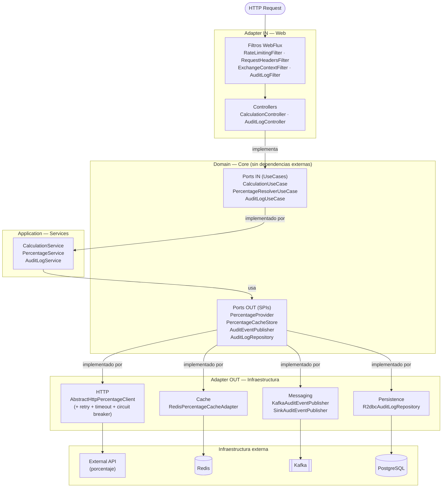
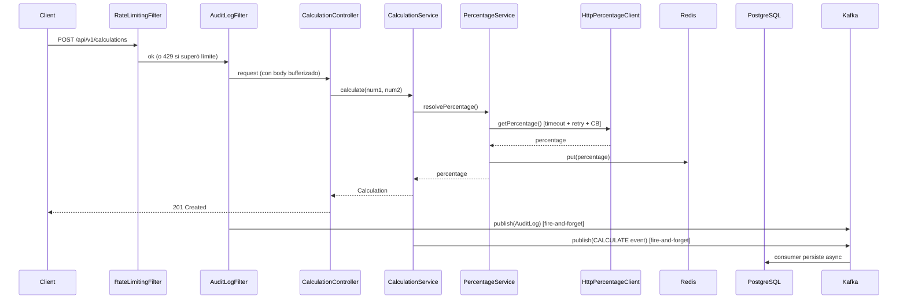

# Arquitectura

Arquitectura hexagonal (Ports & Adapters). El dominio es el núcleo: no tiene dependencias de Spring, de infraestructura ni de ningún framework. Todo lo externo se conecta a través de interfaces (puertos).

---

## Diagrama de capas



---

## Capas

### Domain (núcleo)

Contiene los modelos de dominio y las interfaces de los puertos. No importa nada de Spring ni de infraestructura.

**Ports IN** — definen los casos de uso (qué puede hacer la aplicación):

| Puerto | Método principal |
|---|---|
| `CalculationUseCase` | `Mono<Calculation> calculate(num1, num2)` |
| `PercentageResolverUseCase` | `Mono<BigDecimal> resolvePercentage()` |
| `AuditLogUseCase` | `save`, `findById`, `findAll` |

**Ports OUT** — definen las dependencias externas (qué necesita el dominio):

| Puerto | Propósito |
|---|---|
| `PercentageProvider` | Obtener el porcentaje del proveedor configurado |
| `PercentageCacheStore` | Leer/escribir el último porcentaje en caché |
| `AuditEventPublisher` | Publicar eventos de auditoría (fire-and-forget) |
| `AuditLogRepository` | Persistir y consultar los audit logs |

**Modelos clave:**

| Modelo | Descripción |
|---|---|
| `Calculation` | Resultado de la operación: num1, num2, sum, percentage, result |
| `AuditLog` | Evento de auditoría con snapshot completo de request/response |
| `PercentageCallOutcome` | Resultado de llamada al proveedor, con metadata HTTP |
| `AuditRequestContext` | Contexto propagado por el reactor: transactionalId, userId |

---

### Application (servicios)

Orquestan los puertos para implementar los casos de uso. Dependen solo de interfaces del dominio.

| Servicio | Implementa | Lógica principal |
|---|---|---|
| `CalculationService` | `CalculationUseCase` | Obtiene porcentaje → calcula → audita |
| `PercentageService` | `PercentageResolverUseCase` | Llama al proveedor → fallback a caché → audita cada paso |
| `AuditLogService` | `AuditLogUseCase` | Delega al repositorio |

---

### Adapter IN — Web

Traduce requests HTTP en llamadas a los puertos de entrada.

**Filtros WebFlux** (en orden de ejecución):

| Filtro | Order | Responsabilidad |
|---|---|---|
| `RateLimitingFilter` | 1 | Rate limit por IP con Redis (INCR + EXPIRE) |
| `RequestHeadersFilter` | 2 | Valida `X-Transactional-Id` y `X-User-Id` |
| `ExchangeContextFilter` | 2 | Propaga los headers como `AuditRequestContext` en el reactor context |
| `AuditLogFilter` | 3 | Captura request/response y publica el evento de auditoría |

**Controllers:**

| Controller | Rutas |
|---|---|
| `CalculationController` | `POST /api/v1/calculations` |
| `AuditLogController` | `GET /api/v1/audit-logs` · `/{id}` · `/users/{userId}` · `/transactions/{txId}` |

---

### Adapter OUT — Infraestructura

Implementan los puertos de salida adaptando cada tecnología concreta.

| Adaptador | Puerto | Tecnología |
|---|---|---|
| `AbstractHttpPercentageClient` (base) | `PercentageProvider` | WebClient + Reactor Retry + Resilience4j CB |
| `HttpPercentageClient` | `PercentageProvider` | Servicio externo real |
| `PostmanMockPercentageClient` | `PercentageProvider` | Mock de Postman (desarrollo/testing) |
| `InMemoryPercentageProvider` | `PercentageProvider` | Valor fijo en memoria (modo `memory`) |
| `RedisPercentageCacheAdapter` | `PercentageCacheStore` | ReactiveRedisTemplate |
| `KafkaAuditEventPublisher` | `AuditEventPublisher` | KafkaProducer nativo (async, fire-and-forget) |
| `SinkAuditEventPublisher` | `AuditEventPublisher` | Reactor Sinks + boundedElastic scheduler |
| `R2dbcAuditLogRepository` | `AuditLogRepository` | Spring Data R2DBC + PostgreSQL |

---

### Config

Registradores dinámicos que conectan los adaptadores en tiempo de arranque según las variables de entorno:

| Clase | Qué registra |
|---|---|
| `PercentageProviderRegistrar` | El bean `PercentageProvider` según `PERCENTAGE_PROVIDER` |
| `AuditPublisherRegistrar` | El bean `AuditEventPublisher` según `AUDIT_PUBLISHER` |
| `ResilienceConfig` | El bean `CircuitBreaker` de Resilience4j para el proveedor de porcentaje |

---

## API Versioning

Usa el soporte nativo de Spring Framework 7 con path-segment routing. Los controllers declaran `version = "1"` en sus anotaciones de mapping:

```java
@PostMapping(version = "1")  // → POST /api/v1/calculations
```

Esto permite convivencia de múltiples versiones sin duplicar controladores, gestionado en `WebFluxConfig`.

---

## Flujo de una request de cálculo


