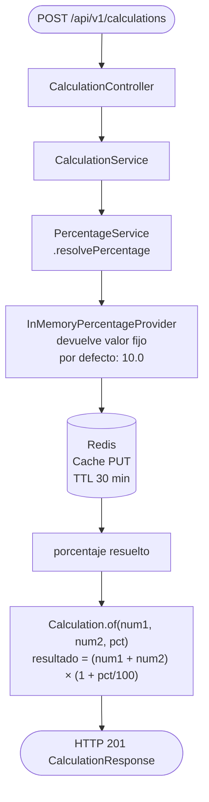
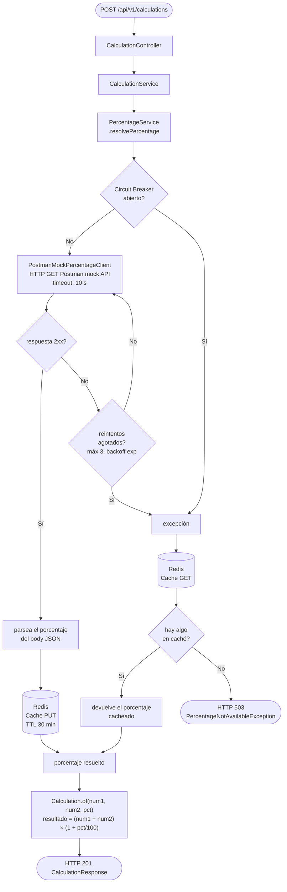

# Flujo de cálculo

## Resumen

El endpoint de cálculo obtiene un porcentaje dinámico desde un proveedor configurable, lo aplica a la suma de dos números y devuelve el resultado. El proveedor activo se elige al arrancar la app con `percentage.provider`.

---

## Flujo: Proveedor en memoria

---

## Flujo: Proveedor Postman Mock

---

## Configuración de resiliencia (Postman Mock / HTTP)

| Parámetro | Valor por defecto |
|-----------|------------------|
| Timeout | 10 s |
| Máximo de reintentos | 3 |
| Backoff inicial | 1 s |
| Backoff máximo | 5 s |
| Ventana deslizante del circuit breaker | 10 llamadas |
| Mínimo de llamadas para evaluar | 5 |
| Umbral de tasa de fallos | 50 % |
| Umbral de llamadas lentas (> 3 s) | 100 % |
| Duración del estado abierto | 30 s |
| Llamadas permitidas en half-open | 3 |
| TTL del caché | 1800 s (30 min) |

---

## Selección de proveedor

Se configura con `percentage.provider` en `application.yaml`:

| Valor | Implementación | Cuándo usarlo |
|-------|---------------|---------------|
| `memory` | `InMemoryPercentageProvider` | Dev local / tests unitarios |
| `postman-mock` | `PostmanMockPercentageClient` | Integración / demo |
| _(por defecto)_ | `HttpPercentageClient` | Servicio externo en producción |
