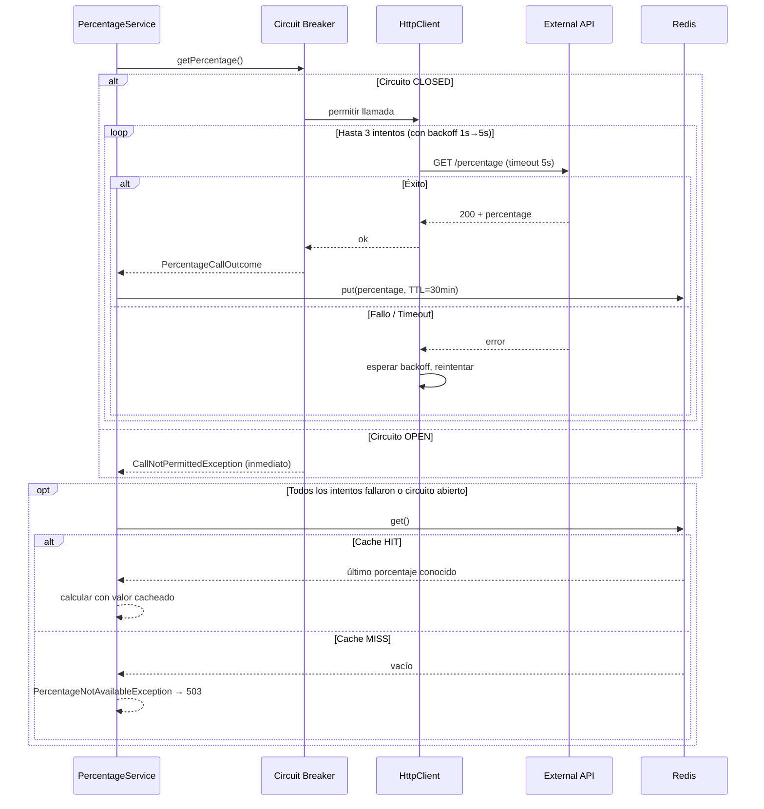

# Resiliencia

El único punto de falla externo es el servicio de porcentaje. La resiliencia se implementa en capas concéntricas aplicadas en `AbstractHttpPercentageClient`:

```
Request → [Timeout] → [Retry con backoff] → [Circuit Breaker] → External API
                                                    ↓ falla
                                          [Fallback a caché Redis]
                                                    ↓ miss
                                               503 Service Unavailable
```

---

## Capas de resiliencia

### 1. Timeout

Corta la llamada HTTP si el proveedor externo no responde en el tiempo configurado. Actúa antes del retry, por lo que cada intento tiene su propio timeout.

| Parámetro | Variable de entorno | Default |
|---|---|---|
| Timeout por llamada | `PERCENTAGE_TIMEOUT_SECONDS` | `5` s |

### 2. Retry con backoff exponencial

Si el proveedor falla (timeout o error HTTP), reintenta automáticamente con espera creciente entre intentos (jitter incluido por Reactor).

| Parámetro | Variable de entorno | Default |
|---|---|---|
| Intentos máximos | `PERCENTAGE_RETRY_MAX_ATTEMPTS` | `3` |
| Backoff inicial | `PERCENTAGE_RETRY_INITIAL_BACKOFF_SECONDS` | `1` s |
| Backoff máximo | `PERCENTAGE_RETRY_MAX_BACKOFF_SECONDS` | `5` s |

**Ejemplo de tiempos de espera** (con jitter pueden variar levemente):

| Intento | Espera antes del intento |
|---|---|
| 1° (original) | — |
| 2° (1er retry) | ~1 s |
| 3° (2° retry) | ~2 s |
| 4° (3er retry) | ~4 s (capped a max 5 s) |

### 3. Circuit Breaker (Resilience4j)

Después de detectar una tasa de fallo elevada, el circuito se abre y rechaza llamadas inmediatamente (sin esperar timeout ni agotar retries), protegiendo el sistema de cascadas de fallos.

| Parámetro | Variable de entorno | Default | Descripción |
|---|---|---|---|
| Tasa de fallo para abrir | `PERCENTAGE_CB_FAILURE_RATE_THRESHOLD` | `50` % | % de llamadas fallidas en la ventana deslizante |
| Tasa de llamadas lentas | `PERCENTAGE_CB_SLOW_CALL_RATE_THRESHOLD` | `100` % | % de llamadas lentas que también abre el circuito |
| Umbral de llamada lenta | `PERCENTAGE_CB_SLOW_CALL_DURATION_SECONDS` | `3` s | Duración a partir de la cual se considera lenta |
| Tamaño de ventana deslizante | `PERCENTAGE_CB_SLIDING_WINDOW_SIZE` | `10` llamadas | Número de llamadas analizadas |
| Mínimo de llamadas | `PERCENTAGE_CB_MINIMUM_NUMBER_OF_CALLS` | `5` | Mínimo antes de evaluar la tasa de fallo |
| Tiempo en estado OPEN | `PERCENTAGE_CB_WAIT_DURATION_OPEN_SECONDS` | `30` s | Segundos antes de pasar a HALF-OPEN |
| Llamadas en HALF-OPEN | `PERCENTAGE_CB_PERMITTED_CALLS_HALF_OPEN` | `3` | Llamadas de prueba en estado HALF-OPEN |

**Estados del circuito:**

```
CLOSED ──(fallo ≥ 50%)──→ OPEN ──(espera 30 s)──→ HALF-OPEN
  ↑                                                     │
  └──────────────(3 llamadas exitosas)──────────────────┘
                         │
                  (falla alguna)
                         ↓
                        OPEN
```

### 4. Fallback a caché Redis

Si el circuito está abierto, o todos los reintentos se agotan, `PercentageService` hace fallback al último valor cacheado en Redis.

| Parámetro | Variable de entorno | Default |
|---|---|---|
| TTL del caché | `PERCENTAGE_CACHE_TTL` | `1800` s (30 min) |
| Clave Redis | — | `percentage:current` |

Si el caché también está vacío → `503 Service Unavailable`.

---

## Flujo completo



---

## Rate Limiting

Independiente del circuit breaker, todas las requests entrantes pasan por rate limiting en Redis antes de llegar a la lógica de negocio.

| Parámetro | Variable de entorno | Default |
|---|---|---|
| Requests máximos | `RATE_LIMIT_MAX_REQUESTS` | `3` por ventana |
| Tamaño de ventana | `RATE_LIMIT_WINDOW_SECONDS` | `60` s |
| Ámbito | — | Por IP |

**Implementación**: patrón `INCR + EXPIRE` en Redis. El `EXPIRE` solo se setea en el primer request de cada ventana (cuando `count == 1`), lo que garantiza atomicidad sin scripts Lua.

**Headers de respuesta:**

| Header | Descripción |
|---|---|
| `X-RateLimit-Limit` | Máximo configurado |
| `X-RateLimit-Remaining` | Requests restantes en la ventana actual |
| `X-RateLimit-Reset` | Segundos hasta el reset de la ventana |
| `Retry-After` | Solo en respuestas `429` |
